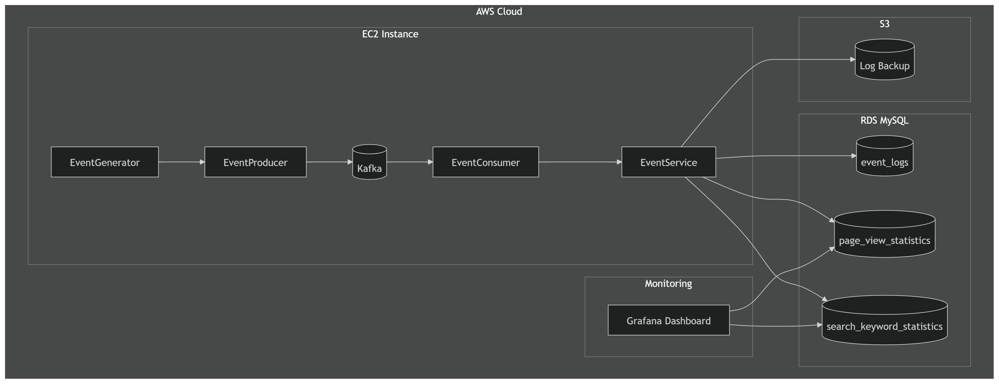
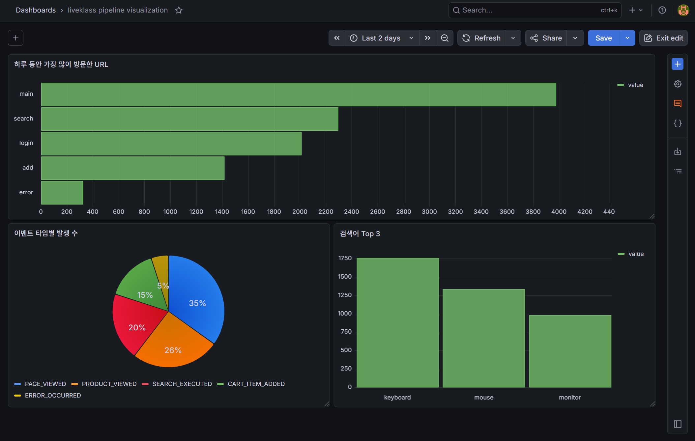

# liveklass

liveklass 채용 과제 제출용 레포지토리입니다.


# 1. 실행 방법

## 필요한 도구

- JDK 21
- Docker Desktop

## 설치 및 실행 순서

1. JDK 21을 설치하였습니다.
2. Docker Desktop을 실행하였습니다.
3. 프로젝트 루트에서 의존 서비스와 애플리케이션을 실행하였습니다.

```bash
./gradlew bootRun
docker compose up --build -d
```

Windows 환경에서는 아래 명령을 사용하였습니다.

```powershell
gradlew.bat bootRun
docker compose up --build -d
```

애플리케이션은 `8082` 포트에서 실행되며, MySQL과 Kafka 설정은 `src/main/resources/application.yaml` 기준으로 동작하도록 구성하였습니다.

데이터 시각화는 Grafana를 사용하였으며, `localhost:3000`으로 접속 후 ID: `admin`, Password: `admin`으로 로그인하여 차트를 생성할 수 있도록 구성하였습니다.


# 2. 스키마 설명

## `event_logs`

개별 이벤트 로그 원본을 저장하기 위한 테이블로 설계하였습니다.

이벤트 종류에 따라 필요한 컬럼만 저장하고, 나머지는 비워둘 수 있도록 구성하여 다양한 이벤트 타입을 하나의 테이블에서 유연하게 처리할 수 있도록 하였습니다.


## `page_view_statistics`

일별 페이지 방문 집계를 저장하기 위한 테이블로 설계하였습니다.

`page_url + statistic_date`에 유니크 키를 설정하여 중복 집계를 방지하였으며, 하루 동안 가장 많이 방문한 URL을 빠르게 조회할 수 있도록 구성하였습니다.


## `search_keyword_statistics`

시간별 검색어 집계를 저장하기 위한 테이블로 설계하였습니다.

`search_keyword + statistic_hour`에 유니크 키를 설정하여 중복 집계를 방지하였으며, 검색어 트렌드를 빠르게 확인할 수 있도록 구성하였습니다.


# 3. 구현하면서 고민한 점

## 데이터 삽입 및 읽기

처음에는 `event_logs` 테이블 하나에 모든 이벤트 로그를 저장한 뒤, `GROUP BY`나 `WHERE` 조건을 활용해 필요한 데이터를 직접 집계하는 구조로 설계하였습니다.

하지만 데이터 양이 증가하면서 조회 시 대량의 데이터를 스캔해야 하는 상황이 발생하였고, 이에 따라 읽기 성능이 점차 저하되는 문제가 나타났습니다.

이러한 문제를 해결하기 위해 읽기와 쓰기의 역할을 분리하는 방향으로 아키텍처를 개선하였습니다.

우선 읽기 성능 향상을 위해 별도의 집계 테이블을 구성하고, 미리 가공된 데이터를 저장하도록 설계하였습니다.

이를 통해 복잡한 집계 쿼리를 수행하지 않더라도 필요한 데이터를 빠르게 조회할 수 있도록 최적화하였습니다.

또한 쓰기 성능과 안정성을 높이기 위해 `Kafka`를 도입하였습니다.

대량의 이벤트가 유입되더라도 Kafka가 버퍼 역할을 수행하도록 구성하여 서버에 직접적인 부하가 집중되지 않도록 하였으며, 비동기 방식으로 데이터를 처리해 안정적인 저장과 함께 전체 처리 성능 또한 향상시킬 수 있도록 구성하였습니다.


## K8s와 Docker Compose

프로젝트는 `Java` 기반의 `Spring Boot` 환경에서 `Kafka Producer`와 `Kafka Consumer`를 분리하여, Producer가 생성한 이벤트를 Consumer가 비동기적으로 처리하는 구조로 설계하였습니다.

초기에는 Producer와 Consumer를 각각 독립된 JVM으로 실행하는 구조를 고려하였습니다.

또한 `Docker Compose`를 활용하여 멀티 컨테이너 환경을 구성하고자 하였습니다.

하지만 Docker Compose를 처음 다루면서 컨테이너 간 네트워크 설정, 포트 충돌 문제 등을 반복적으로 겪었고, 여러 `JVM`을 동시에 관리하는 과정에서도 많은 시행착오가 발생하였습니다.

결국 프로젝트 완성도를 우선적으로 고려하여 Producer와 Consumer를 하나의 JVM 내부에서 동작하도록 구조를 단순화하였습니다.

비록 최종적으로는 단일 JVM 구조를 선택하였지만, 이 과정을 통해 분산 환경에서의 서비스 관리와 컨테이너 오케스트레이션의 필요성을 직접 경험할 수 있었습니다.

만약 프로젝트를 추가로 확장할 수 있었다면, Producer와 Consumer를 완전히 분리된 서비스로 운영하고 `Kubernetes(K8s)`를 활용하여 컨테이너 배포, 스케일링, 장애 복구까지 고려한 구조로 발전시키고자 하였습니다.

특히 트래픽 증가 상황에서 Consumer를 수평 확장하거나, Kafka 기반 이벤트 처리 파이프라인을 안정적으로 운영하는 구조까지 경험해보고자 하였습니다.

이번 프로젝트를 통해 단순히 기능 구현에만 집중하기보다, 실제 서비스 환경에서는 어떤 구조가 필요한지 고민하고 직접 설계해보는 과정 자체가 큰 배움이 되었습니다.


## 객체 생성 구조 리팩토링

`EventGenerator`에서 `builder().build().build()` 형태의 중복 호출이 발생하는 문제가 있었습니다.

원인은 `EventRequest` 생성을 위해 중간 가교 역할을 하는 `EventRequestBuilder`를 별도로 두면서, Builder 패턴이 불필요하게 한 단계 더 중첩된 구조로 설계되어 있었기 때문이었습니다.

이를 해결하기 위해 `EventRequestBuilder`를 제거하고, `EventRequest` 클래스 자체에 Lombok의 `@Builder`를 적용하였습니다.

그 결과 객체 생성 흐름이 더욱 단순해졌으며, 코드의 가독성과 유지보수성 또한 함께 개선할 수 있었습니다.


# 4. AWS 기초 이해 - DFD




## EC2, S3, RDS 사용 이유

### EC2

EC2는 AWS에서 제공하는 가상 컴퓨팅 서비스로, 사용자가 원하는 서버 환경을 직접 구성하고 애플리케이션을 안정적으로 실행할 수 있도록 지원합니다.

이번 프로젝트에서는 Spring Boot와 Kafka 기반의 이벤트 생성 및 처리 서버를 지속적으로 운영해야 했기 때문에 EC2를 활용하였습니다.

로컬 환경 대신 클라우드 서버를 사용함으로써 보다 안정적인 운영 환경을 구축할 수 있었으며, AWS의 보안 그룹(Security Group) 기능을 통해 접근 제어 또한 효율적으로 설정할 수 있도록 구성하였습니다.

---

### S3

S3는 AWS에서 제공하는 객체 스토리지 서비스로, 대용량 파일을 안정적으로 저장할 수 있으며 높은 확장성과 내구성을 제공하는 것이 특징입니다.

이번 프로젝트에서는 지속적으로 생성되는 이벤트 로그 데이터를 장기간 보관하기 위해 S3를 활용하였습니다.

초당 여러 건의 이벤트가 생성되는 구조 특성상 로그 데이터가 빠르게 증가할 수 있었기 때문에, 이를 안정적으로 저장하고 백업할 수 있는 스토리지 서비스가 필요하다고 판단하였습니다.

이를 통해 대량의 로그 데이터를 효율적으로 관리할 수 있었으며, 장기 보관 및 추후 데이터 분석에도 활용할 수 있는 환경을 구성하였습니다.

---

### RDS

RDS는 AWS에서 제공하는 관리형 데이터베이스 서비스로, 데이터베이스의 설치·운영·유지보수 부담을 줄여 보다 효율적인 운영을 가능하게 합니다.

이번 프로젝트에서는 이벤트 로그와 통계 데이터의 안정적인 저장을 위해 RDS MySQL을 도입하였습니다.

로그 데이터는 지속적으로 누적되는 특성상 데이터 보관의 안정성이 핵심 요건이었으며, RDS의 자동 백업 기능을 활용해 데이터 손실 위험을 최소화하였습니다.

또한 순간적인 트래픽 급증 상황에서도 Multi-AZ 구성 및 복제 기능을 통해 가용성과 내결함성을 확보할 수 있다는 점에서 RDS가 최적의 선택이라고 판단하였습니다.


## AWS 서비스 역할 차이

이번 프로젝트에서는 각 AWS 서비스가 서로 다른 역할을 담당하도록 구성하였습니다.

### EC2

Spring Boot와 Kafka 서버를 실행하는 역할을 담당하도록 구성하였습니다.

즉, 실제 애플리케이션이 동작하는 실행 환경으로 활용하였습니다.

---

### RDS

이벤트 로그와 통계 데이터를 저장하는 데이터베이스 역할을 담당하도록 구성하였습니다.

Kafka Consumer가 처리한 데이터를 안정적으로 저장하고 조회할 수 있도록 설계하였습니다.

---

### S3

지속적으로 증가하는 로그 데이터를 장기간 보관하고 백업하는 역할로 사용하였습니다.

운영 데이터는 RDS에서 관리하고, 대용량 로그 파일은 S3에 저장하도록 역할을 분리하였습니다.

---

### Grafana

RDS에 저장된 통계 데이터를 시각화하는 역할을 담당하도록 구성하였습니다.

집계 테이블 데이터를 기반으로 조회수 및 검색어 통계 등을 그래프로 확인할 수 있도록 구성하였습니다.

이번 프로젝트를 진행하면서 모든 기능을 하나의 서비스에서 처리하기보다, 각 서비스가 담당하는 역할을 분리하는 것이 안정성과 관리 측면에서 중요하다는 점을 배울 수 있었습니다.


## AWS 아키텍처 설계에서 가장 고민한 부분

가장 고민했던 부분은 대량의 이벤트 로그를 어떻게 안정적으로 저장하고 빠르게 조회할 것인가였습니다.

초기에는 모든 이벤트를 단일 테이블에서 직접 집계하는 구조를 고려하였으나, 데이터가 누적될수록 조회 성능이 점차 저하되는 문제가 발생하였습니다.

이를 해결하기 위해 다음과 같은 방향으로 아키텍처를 재설계하였습니다.

- Kafka 도입으로 이벤트를 비동기적으로 처리하여 실시간 부하를 분산하도록 구성하였습니다.
- 통계 테이블 분리를 통해 집계 쿼리의 성능을 개선하도록 설계하였습니다.
- 역할 기반 스토리지 분리를 적용하여 운영 데이터는 RDS에서 관리하고, 장기 보관이 필요한 로그 데이터는 S3에 백업하도록 구성하였습니다.

이 과정을 통해 단순한 기능 구현을 넘어, 데이터 흐름과 서비스 역할 분리를 고려한 아키텍처 설계의 중요성을 깊이 이해할 수 있었습니다.


# 5. 시각화 이미지

